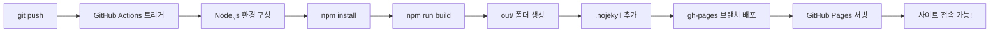

# 🏃‍♂️ 12주 건강관리 체크리스트

[](https://kdkim2000.github.io/12week-health-tracker/)
[](https://nextjs.org/)
[](https://react.dev/)
[](https://www.typescriptlang.org/)
[](https://mui.com/)
[](LICENSE)

> **🎓 Next.js 초보자를 위한 실전 프로젝트**  
> 12주간의 운동습관과 생활지표를 기록하고 관리하는 웹 애플리케이션을 만들면서  
> Next.js의 핵심 개념과 실전 개발 경험을 쌓을 수 있습니다.

---

## 🌐 라이브 데모

👉 **[https://kdkim2000.github.io/12week-health-tracker/](https://kdkim2000.github.io/12week-health-tracker/)**

지금 바로 접속하여 체험해보세요! 회원가입 후 12주 건강관리를 시작할 수 있습니다.

---

## 📖 목차

- [프로젝트 소개](#-프로젝트-소개)
- [주요 기능](#-주요-기능)
- [기술 스택](#-기술-스택)
- [학습 포인트](#-학습-포인트---이-프로젝트에서-배울-수-있는-것들)
- [시작하기](#-시작하기)
- [프로젝트 구조](#-프로젝트-구조)
- [핵심 구현 설명](#-핵심-구현-설명)
- [GitHub Pages 배포](#-github-pages-배포)
- [트러블슈팅](#-트러블슈팅)
- [향후 개선 방향](#-향후-개선-방향)
- [기여하기](#-기여하기)
- [라이선스](#-라이선스)

---

## 🎯 프로젝트 소개

### 왜 이 프로젝트를 만들었나요?

**Next.js를 배우고 싶지만 어디서부터 시작해야 할지 막막한 분들을 위해** 제작되었습니다.

- 📚 **교육 목적**: 튜토리얼이 아닌 실제 사용 가능한 애플리케이션
- 💪 **실생활 활용**: 본인의 건강관리에 실제로 사용 가능
- 🔍 **코드 학습**: 각 파일마다 상세한 주석으로 Why & How 설명
- 🚀 **배포 경험**: GitHub Actions를 통한 자동 배포까지 경험

### 어떤 앱인가요?

12주(84일)간의 **운동**, **식단**, **체중**을 매일 기록하고,  
시각적으로 확인하며 건강한 습관을 만들어가는 웹 애플리케이션입니다.

---

## ✨ 주요 기능

### 🔐 사용자 인증 시스템
```
회원가입 → 자동 로그인 → 12주 프로그램 시작
```
- 이메일/비밀번호 기반 인증
- 로컬 스토리지를 활용한 데이터 저장
- 로그인 상태 유지

### 📅 일일 체크리스트
매일 3가지를 기록할 수 있습니다:
| 항목 | 설명 |
|------|------|
| ✅ 운동 완료 | 오늘 운동을 했나요? |
| 🍎 식단 준수 | 계획한 식단을 지켰나요? |
| ⚖️ 체중 기록 | 오늘의 체중은? (선택사항) |

### 📊 시각화 대시보드

#### 1. 12주 달력 뷰
```
┌─────────────────────────────────────┐
│  1주차  [■][■][■][■][■][□][□]      │
│  2주차  [■][■][■][○][○][  ][  ]    │
│  3주차  [  ][  ][  ][  ][  ][  ][  ]│
│  ...                                 │
└─────────────────────────────────────┘

■ 완료   ○ 일부 완료   □ 미완료   [  ] 미래
```

#### 2. 색상 코딩 시스템
- 🟢 **초록색**: 운동 + 식단 모두 완료 (완벽!)
- 🟡 **노란색**: 둘 중 하나만 완료 (괜찮아요!)
- 🔴 **빨간색**: 아무것도 안 함 (힘내세요!)
- ⚪ **회색**: 아직 오지 않은 날

#### 3. 통계 분석
- **전체 진행률**: 현재 몇 주차인지, 달성률은 몇 %인지
- **주차별 달성률**: 각 주의 성과를 카드 형태로 표시
- **실시간 업데이트**: 기록하면 즉시 반영

### 📱 모바일 최적화
- **반응형 디자인**: PC, 태블릿, 모바일 모두 지원
- **터치 친화적**: 손가락으로 편하게 조작
- **빠른 로딩**: 정적 사이트 생성으로 초고속

---

## 🛠️ 기술 스택

### Core Technologies
| 기술 | 버전 | 역할 |
|------|------|------|
| **Next.js** | 15.5.4 | React 프레임워크 (App Router) |
| **React** | 19.0.0 | UI 라이브러리 |
| **TypeScript** | 5.6+ | 타입 안정성 |
| **Material-UI** | 7.0.0 | UI 컴포넌트 라이브러리 |

### Infrastructure
| 기술 | 용도 |
|------|------|
| **GitHub Actions** | CI/CD 자동화 |
| **GitHub Pages** | 정적 사이트 호스팅 |
| **Local Storage** | 브라우저 데이터 저장 |

### Why These Technologies?

#### 1. **Next.js를 선택한 이유**
- ✅ React의 복잡한 설정을 자동화
- ✅ 파일 기반 라우팅 (직관적!)
- ✅ Server/Client Component 구분 학습
- ✅ 정적 사이트 생성 (빠른 속도)

#### 2. **TypeScript를 선택한 이유**
- ✅ 코드 작성 중 오류 미리 발견
- ✅ 자동완성으로 개발 속도 향상
- ✅ 대규모 프로젝트에서 필수

#### 3. **Material-UI를 선택한 이유**
- ✅ 구글의 Material Design 기반
- ✅ 풍부한 컴포넌트 (버튼, 카드, 다이얼로그 등)
- ✅ 반응형 디자인 자동 지원

#### 4. **Local Storage를 선택한 이유**
- ✅ 서버 없이 작동 (배포 간편)
- ✅ 오프라인 지원
- ✅ 초보자가 배우기 쉬움

---

## 🎓 학습 포인트 - 이 프로젝트에서 배울 수 있는 것들

### 1️⃣ Next.js 핵심 개념

#### **App Router (파일 기반 라우팅)**
```
app/
├── layout.tsx          → 모든 페이지의 공통 레이아웃
├── page.tsx            → / (메인 페이지)
├── login/
│   └── page.tsx        → /login
└── signup/
    └── page.tsx        → /signup
```

**배울 수 있는 것:**
- 폴더 구조 = URL 구조
- `layout.tsx`로 공통 레이아웃 관리
- `page.tsx`가 실제 페이지 컴포넌트

**코드 예시:**
```typescript
// app/login/page.tsx
export default function LoginPage() {
  return <div>로그인 페이지</div>;
}
// → 자동으로 /login URL에 매핑됨!
```

#### **Server Component vs Client Component**
```typescript
// Server Component (기본)
// app/page.tsx
export default function HomePage() {
  // 서버에서만 실행됨
  const data = await fetchData();
  return <div>{data}</div>;
}

// Client Component
// components/Calendar.tsx
'use client'; // ← 이 선언이 핵심!
export default function Calendar() {
  const [state, setState] = useState([]); // Hook 사용 가능
  return <div onClick={...}>...</div>; // 이벤트 처리 가능
}
```

**언제 Client Component를 쓰나요?**
- ✅ `useState`, `useEffect` 등 Hook 사용할 때
- ✅ `onClick` 등 브라우저 이벤트 처리할 때
- ✅ 브라우저 API (localStorage) 사용할 때

**언제 Server Component를 쓰나요?**
- ✅ 데이터 fetching만 하는 경우
- ✅ 정적인 콘텐츠 표시
- ✅ 기본값! (특별한 이유 없으면 Server Component)

#### **Static Site Generation (SSG)**
```typescript
// next.config.ts
export default {
  output: 'export', // ← 이 설정으로 정적 HTML 생성
};
```

**npm run build 실행 시:**
```
.next/ → out/ 폴더로 정적 파일 생성
out/
├── index.html          (메인 페이지)
├── login.html          (로그인 페이지)
├── _next/              (CSS, JS 파일들)
└── ...
```

**장점:**
- ⚡ 초고속 로딩 (미리 생성된 HTML)
- 💰 서버 비용 0원 (GitHub Pages 무료)
- 🔒 보안 우수 (서버 로직 없음)

---

### 2️⃣ React 19 최신 기능

#### **useState - 상태 관리**
```typescript
const [email, setEmail] = useState('');
//     ↑현재값  ↑변경함수    ↑초기값

// 사용 예시
<input 
  value={email} 
  onChange={(e) => setEmail(e.target.value)}
/>
```

**실전 활용:**
- 폼 입력값 관리
- 모달 열기/닫기 상태
- 로딩 상태 표시

#### **useEffect - 부수 효과 처리**
```typescript
useEffect(() => {
  // 컴포넌트가 마운트될 때 실행
  const user = getCurrentUser();
  if (!user) {
    router.push('/login'); // 로그인 페이지로 이동
  }
}, []); // ← 빈 배열: 최초 1회만 실행
```

**실전 활용:**
- 컴포넌트 마운트 시 데이터 로드
- 로그인 체크
- 외부 API 호출

#### **Custom Hooks 패턴**
```typescript
// lib/auth.ts
export function login(email, password) {
  // 로그인 로직
  return { success: true, userId: '...' };
}

// 컴포넌트에서 사용
const result = login(email, password);
if (result.success) {
  router.push('/');
}
```

---

### 3️⃣ TypeScript 실전 활용

#### **Interface로 타입 정의**
```typescript
// types/index.ts
export interface User {
  id: string;
  email: string;
  password: string;
  startDate: string;
  createdAt: string;
}

// 사용
function getUser(id: string): User | null {
  // id는 반드시 string
  // 반환값은 User 또는 null
}
```

**왜 필요한가요?**
- ✅ 실수로 다른 타입 전달 시 즉시 에러
- ✅ 자동완성으로 개발 속도 2배
- ✅ 리팩토링 시 안전성 보장

#### **Props 타입 정의**
```typescript
interface CalendarProps {
  dates: string[];
  dailyChecks: { [date: string]: DailyCheck };
  onSaveCheck: (check: DailyCheck) => void;
}

function Calendar({ dates, dailyChecks, onSaveCheck }: CalendarProps) {
  // props 자동완성됨!
  // 잘못된 props 전달 시 컴파일 에러
}
```

---

### 4️⃣ Material-UI 컴포넌트 활용

#### **Theme 설정**
```typescript
// app/theme.ts
const theme = createTheme({
  palette: {
    primary: { main: '#2196F3' },    // 파란색
    success: { main: '#4CAF50' },    // 초록색
    warning: { main: '#FFC107' },    // 노란색
  },
});
```

**전역 스타일 적용:**
```typescript
// app/layout.tsx
<ThemeProvider theme={theme}>
  <CssBaseline /> {/* 브라우저 기본 스타일 초기화 */}
  {children}
</ThemeProvider>
```

#### **반응형 디자인**
```typescript
<Container maxWidth="lg">  {/* 큰 화면에서 최대 너비 제한 */}
  <Grid container spacing={2}>
    <Grid item xs={12} sm={6} md={4}>
      {/* xs: 모바일 12칸 (전체) */}
      {/* sm: 태블릿 6칸 (절반) */}
      {/* md: 데스크톱 4칸 (1/3) */}
    </Grid>
  </Grid>
</Container>
```

#### **sx prop으로 스타일링**
```typescript
<Box
  sx={{
    p: 3,                    // padding: 24px (3 * 8px)
    mb: 2,                   // margin-bottom: 16px
    bgcolor: 'primary.main', // theme의 primary 색상
    '&:hover': {             // hover 시 스타일
      opacity: 0.8,
    },
  }}
>
  ...
</Box>
```

---

### 5️⃣ 로컬 스토리지 활용

#### **데이터 구조**
```javascript
// 브라우저의 localStorage에 저장되는 구조
{
  "health-tracker-data": {
    "currentUser": "user-123",
    "users": {
      "user-123": {
        "id": "user-123",
        "email": "user@example.com",
        "password": "hashed",
        "startDate": "2025-01-01"
      }
    },
    "dailyChecks": {
      "user-123": {
        "2025-01-01": {
          "date": "2025-01-01",
          "exerciseCompleted": true,
          "dietCompleted": true,
          "weight": 70.5
        }
      }
    }
  }
}
```

#### **CRUD 연산**
```typescript
// 저장 (Create/Update)
export function saveDailyCheck(userId: string, check: DailyCheck) {
  const data = JSON.parse(localStorage.getItem('health-tracker-data'));
  data.dailyChecks[userId][check.date] = check;
  localStorage.setItem('health-tracker-data', JSON.stringify(data));
}

// 조회 (Read)
export function getDailyCheck(userId: string, date: string) {
  const data = JSON.parse(localStorage.getItem('health-tracker-data'));
  return data.dailyChecks[userId]?.[date] || null;
}

// 삭제 (Delete)
export function deleteDailyCheck(userId: string, date: string) {
  const data = JSON.parse(localStorage.getItem('health-tracker-data'));
  delete data.dailyChecks[userId][date];
  localStorage.setItem('health-tracker-data', JSON.stringify(data));
}
```

#### **주의사항**
⚠️ **Local Storage의 한계:**
- 용량: 5-10MB (브라우저마다 다름)
- 보안: 암호화되지 않음 (민감 정보 주의)
- 동기화: 다른 기기와 공유 불가
- 삭제: 브라우저 캐시 지우면 모두 삭제

**실전 팁:**
```typescript
// 항상 try-catch로 감싸기
try {
  localStorage.setItem('key', value);
} catch (error) {
  console.error('Storage full or disabled');
}
```

---

### 6️⃣ 날짜 계산 로직

#### **12주(84일) 생성**
```typescript
export function get12WeekDates(startDate: string): string[] {
  const dates = [];
  for (let i = 0; i < 84; i++) {
    const date = new Date(startDate);
    date.setDate(date.getDate() + i);
    dates.push(formatDate(date));
  }
  return dates;
}

// 사용 예시
const dates = get12WeekDates('2025-01-01');
// ['2025-01-01', '2025-01-02', ..., '2025-03-25']
```

#### **주차 계산**
```typescript
export function getWeekNumber(startDate: string, targetDate: string) {
  const days = daysBetween(startDate, targetDate);
  return Math.floor(days / 7) + 1; // 1주차부터 시작
}

// 예시
getWeekNumber('2025-01-01', '2025-01-08'); // 2주차
```

---

### 7️⃣ GitHub Actions CI/CD

#### **워크플로우 구조**
```yaml
# .github/workflows/deploy.yml
name: Deploy to GitHub Pages

on:
  push:
    branches: ["main"]  # main 브랜치에 푸시할 때

jobs:
  build:
    runs-on: ubuntu-latest
    steps:
      - name: Checkout code
      - name: Setup Node.js
      - name: Install dependencies
      - name: Build
      - name: Upload artifact
  
  deploy:
    needs: build  # build 완료 후 실행
    steps:
      - name: Deploy to GitHub Pages
```

#### **자동 배포 흐름**
```
1. git push origin main
   ↓
2. GitHub Actions 자동 실행
   ↓
3. npm install
   ↓
4. npm run build (out/ 폴더 생성)
   ↓
5. out/ 폴더를 gh-pages 브랜치에 배포
   ↓
6. GitHub Pages가 자동으로 서빙
   ↓
7. https://kdkim2000.github.io/12week-health-tracker/ 업데이트!
```

#### **basePath 설정의 중요성**
```typescript
// next.config.ts
const nextConfig = {
  basePath: process.env.NODE_ENV === 'production' 
    ? '/12week-health-tracker'  // GitHub Pages URL
    : '',                         // 로컬에서는 비활성화
};
```

**왜 필요한가요?**
```
GitHub Pages URL: https://사용자명.github.io/저장소명/
                                                 ↑
                                    이 부분을 basePath로 설정
```

**없으면 어떻게 되나요?**
```
❌ CSS 경로: /12week-health-tracker/_next/static/css/...
✅ 실제 경로: /_next/static/css/...
→ 404 에러! 흰 화면만 보임
```

---

## 🚀 시작하기

### 사전 요구사항

다음 프로그램들이 설치되어 있어야 합니다:

```bash
# Node.js 버전 확인
node --version
# v18.17.0 이상 필요

# npm 버전 확인
npm --version
# 9.0.0 이상 권장
```

Node.js가 없다면?  
👉 [Node.js 공식 사이트](https://nodejs.org/)에서 LTS 버전 다운로드

---

### 로컬 개발 환경 설정

#### 1️⃣ 저장소 클론
```bash
git clone https://github.com/kdkim2000/12week-health-tracker.git
cd 12week-health-tracker
```

#### 2️⃣ 의존성 설치
```bash
npm install
```

**이 과정에서 일어나는 일:**
- `package.json`의 모든 라이브러리 다운로드
- `node_modules/` 폴더 생성 (수백 MB)
- 약 1-2분 소요

#### 3️⃣ 개발 서버 실행
```bash
npm run dev
```

**출력 결과:**
```
▲ Next.js 15.5.4
- Local:   http://localhost:3000
- Network: http://192.168.0.10:3000

✓ Ready in 3.2s
```

#### 4️⃣ 브라우저에서 확인
```
http://localhost:3000
```

**축하합니다! 🎉 로컬에서 실행 중입니다!**

---

### 개발 중 유용한 명령어

```bash
# 개발 서버 실행 (Hot Reload 지원)
npm run dev

# 프로덕션 빌드 (배포 전 테스트)
npm run build

# 빌드된 파일 실행
npm run start

# ESLint로 코드 검사
npm run lint

# TypeScript 타입 체크
npx tsc --noEmit
```

---

## 📁 프로젝트 구조

```
12week-health-tracker/
├── 📂 .github/
│   └── workflows/
│       └── deploy.yml              # GitHub Actions 배포 설정
│
├── 📂 app/                          # Next.js App Router
│   ├── layout.tsx                  # 루트 레이아웃 (전체 페이지 공통)
│   ├── page.tsx                    # 메인 대시보드 (/)
│   ├── theme.ts                    # MUI 테마 설정
│   ├── login/
│   │   └── page.tsx                # 로그인 페이지 (/login)
│   └── signup/
│       └── page.tsx                # 회원가입 페이지 (/signup)
│
├── 📂 components/                   # 재사용 가능한 컴포넌트
│   ├── Calendar.tsx                # 12주 달력 (핵심 컴포넌트!)
│   ├── DailyCheckForm.tsx          # 일일 체크 입력 폼
│   ├── ProgressBar.tsx             # 전체 진행률 표시
│   └── WeeklyStats.tsx             # 주차별 통계 카드
│
├── 📂 lib/                          # 유틸리티 함수
│   ├── auth.ts                     # 로그인/회원가입 로직
│   ├── dateUtils.ts                # 날짜 계산 함수
│   └── localStorage.ts             # 로컬 스토리지 CRUD
│
├── 📂 types/                        # TypeScript 타입 정의
│   └── index.ts                    # 공통 인터페이스
│
├── 📄 next.config.ts               # Next.js 설정 (중요!)
├── 📄 tsconfig.json                # TypeScript 설정
├── 📄 package.json                 # 프로젝트 메타데이터
├── 📄 .eslintrc.json               # ESLint 규칙
└── 📄 README.md                    # 이 문서
```

### 각 폴더의 역할

#### **app/** - 페이지와 라우팅
- ✅ 파일명이 곧 URL 경로
- ✅ `layout.tsx`: 모든 페이지의 공통 부분
- ✅ `page.tsx`: 실제 페이지 콘텐츠

#### **components/** - 재사용 컴포넌트
- ✅ 여러 페이지에서 사용
- ✅ UI 로직과 상태 관리
- ✅ 'use client' 선언 필수

#### **lib/** - 비즈니스 로직
- ✅ 순수 함수 (UI 없음)
- ✅ 테스트 가능한 유틸리티
- ✅ 재사용 가능한 로직

#### **types/** - 타입 정의
- ✅ 인터페이스와 타입 선언
- ✅ 전역으로 사용
- ✅ 타입 안정성 보장

---

## 🔍 핵심 구현 설명

### 1. 달력 시각화 (Calendar.tsx)

#### **핵심 아이디어**
84일을 7일씩 묶어 12개의 주로 표시

```typescript
// 84일을 7일씩 나누기
const weeks: string[][] = [];
for (let i = 0; i < dates.length; i += 7) {
  weeks.push(dates.slice(i, i + 7));
}

// 결과
[
  ['2025-01-01', '2025-01-02', ..., '2025-01-07'],  // 1주차
  ['2025-01-08', '2025-01-09', ..., '2025-01-14'],  // 2주차
  ...
]
```

#### **색상 결정 로직**
```typescript
function getDateStatus(date: string) {
  if (isFuture(date)) return 'future';      // 회색
  
  const check = dailyChecks[date];
  if (!check) return 'incomplete';          // 빨간색
  
  if (check.exerciseCompleted && check.dietCompleted) {
    return 'completed';                     // 초록색
  } else if (check.exerciseCompleted || check.dietCompleted) {
    return 'partial';                       // 노란색
  }
  
  return 'incomplete';                      // 빨간색
}
```

#### **반응형 그리드**
```typescript
<Grid container spacing={1}>
  {week.map(date => (
    <Grid item xs={12/7}>  {/* 7개가 한 줄 */}
      <Paper onClick={() => handleClick(date)}>
        {날짜 표시}
      </Paper>
    </Grid>
  ))}
</Grid>
```

---

### 2. 로컬 스토리지 관리 (localStorage.ts)

#### **싱글톤 패턴**
```typescript
const STORAGE_KEY = 'health-tracker-data';

// 데이터 가져오기
function getData() {
  const json = localStorage.getItem(STORAGE_KEY);
  return json ? JSON.parse(json) : initialData;
}

// 데이터 저장하기
function setData(data) {
  localStorage.setItem(STORAGE_KEY, JSON.stringify(data));
}
```

#### **옵셔널 체이닝 활용**
```typescript
// ❌ 오류 발생 가능
const check = data.dailyChecks[userId][date];

// ✅ 안전한 접근
const check = data.dailyChecks[userId]?.[date] || null;
//                                      ↑ 옵셔널 체이닝
```

---

### 3. 날짜 계산 (dateUtils.ts)

#### **날짜 포맷팅**
```typescript
function formatDate(date: Date): string {
  const year = date.getFullYear();
  const month = String(date.getMonth() + 1).padStart(2, '0');
  const day = String(date.getDate()).padStart(2, '0');
  return `${year}-${month}-${day}`;
}

// 예시
formatDate(new Date('2025-01-05'));  // '2025-01-05'
```

#### **날짜 더하기**
```typescript
function addDays(startDate: string, days: number): string {
  const date = new Date(startDate);
  date.setDate(date.getDate() + days);
  return formatDate(date);
}

// 예시
addDays('2025-01-01', 7);  // '2025-01-08'
```

---

### 4. 상태 관리 패턴

#### **State Lifting (상태 끌어올리기)**
```typescript
// ❌ 각 컴포넌트가 따로 관리 (비효율)
<Calendar data={data1} />
<Stats data={data2} />  // 동기화 문제!

// ✅ 부모가 통합 관리
function Dashboard() {
  const [dailyChecks, setDailyChecks] = useState({});
  
  return (
    <>
      <Calendar 
        dailyChecks={dailyChecks}
        onSave={(check) => {
          saveDailyCheck(userId, check);
          setDailyChecks({...dailyChecks}); // 리렌더링
        }}
      />
      <Stats dailyChecks={dailyChecks} />
    </>
  );
}
```

#### **불변성 유지**
```typescript
// ❌ 직접 수정 (React가 변화 감지 못함)
dailyChecks[date] = newCheck;
setDailyChecks(dailyChecks);

// ✅ 새 객체 생성 (React가 변화 감지)
setDailyChecks({
  ...dailyChecks,
  [date]: newCheck
});
```

---

## 🚀 GitHub Pages 배포

### 1단계: 저장소 설정

#### GitHub에서 새 저장소 생성
```
Repository name: 12week-health-tracker
Description: 12주 건강관리 체크리스트
Public ✓
```

#### 로컬 코드 푸시
```bash
git init
git add .
git commit -m "Initial commit"
git branch -M main
git remote add origin https://github.com/사용자명/12week-health-tracker.git
git push -u origin main
```

---

### 2단계: GitHub Actions 설정

#### 워크플로우 파일 확인
```yaml
# .github/workflows/deploy.yml
name: Deploy to GitHub Pages

on:
  push:
    branches: ["main"]
```

이 파일이 있으면 **자동 배포** 설정 완료!

---

### 3단계: GitHub Pages 활성화

1. **Settings** 탭 클릭
2. 좌측 메뉴에서 **Pages** 클릭
3. **Source** 선택
   ```
   Source: GitHub Actions
   ```
4. 저장

---

### 4단계: 배포 확인

#### GitHub Actions 탭에서 확인
```
Actions → Deploy to GitHub Pages

✓ build (1m 23s)
✓ deploy (34s)
```

#### 배포 완료!
```
🌐 Your site is live at:
https://kdkim2000.github.io/12week-health-tracker/
```

---

### 배포 과정 상세 설명



#### 각 단계 설명

**1. git push** (1초)
```bash
git push origin main
# → GitHub 서버로 코드 전송
```

**2. GitHub Actions 트리거** (5초)
```yaml
on:
  push:
    branches: ["main"]
# → main 브랜치 푸시 감지
```

**3-4. 환경 구성 + 의존성 설치** (30초)
```bash
npm install
# → node_modules/ 생성
```

**5. 빌드** (1분)
```bash
npm run build
# → Next.js가 정적 HTML 생성
# → out/ 폴더에 저장
```

**6. .nojekyll 추가** (1초)
```bash
touch out/.nojekyll
# → Jekyll 비활성화 (중요!)
```

**7-8. 배포** (20초)
```bash
# gh-pages 브랜치에 out/ 푸시
# → GitHub Pages가 자동 감지
```

**9. 사이트 접속 가능** (1분 대기)
```
https://kdkim2000.github.io/12week-health-tracker/
```

#### 전체 소요 시간
```
총 약 3-4분
(코드 푸시 → 사이트 업데이트)
```

---

### 배포 후 확인사항

#### ✅ 체크리스트
- [ ] 사이트가 로드되는가?
- [ ] CSS가 정상 적용되었는가?
- [ ] 로그인이 작동하는가?
- [ ] 달력이 보이는가?
- [ ] 날짜 클릭 시 폼이 나타나는가?
- [ ] 데이터가 저장되는가?

#### 🐛 문제 해결

**흰 화면만 보인다면?**
```bash
# .nojekyll 파일 확인
ls out/.nojekyll

# 없으면 deploy.yml에 추가
- name: Create .nojekyll
  run: touch ./out/.nojekyll
```

**404 에러가 난다면?**
```typescript
// next.config.ts 확인
basePath: '/12week-health-tracker',  // 저장소명 확인
```

**CSS가 안 보인다면?**
```typescript
// assetPrefix도 설정했는지 확인
assetPrefix: '/12week-health-tracker',
```

---

## 🛠️ 트러블슈팅

### 자주 묻는 질문 (FAQ)

#### Q1. 로그인 후 데이터가 사라졌어요!
**A:** 브라우저 캐시를 지웠거나, 시크릿 모드를 사용 중일 수 있습니다.

**해결:**
- 일반 모드 사용
- 같은 브라우저 사용
- F12 → Application → Local Storage 확인

---

#### Q2. 다른 기기에서도 데이터를 보고 싶어요!
**A:** 현재 버전은 로컬 스토리지만 사용하여 불가능합니다.

**해결 방법 (향후 개선):**
1. 백엔드 API 구축 (Node.js + Express)
2. 데이터베이스 연동 (MongoDB, PostgreSQL)
3. 클라우드 스토리지 (Firebase, Supabase)

---

#### Q3. npm install이 오래 걸려요!
**A:** 정상입니다. 수백 개의 패키지를 다운로드하기 때문입니다.

**최적화:**
```bash
# npm 대신 pnpm 사용 (더 빠름)
npm install -g pnpm
pnpm install
```

---

#### Q4. 빌드 시 TypeScript 오류가 나요!
**A:** 타입 오류를 수정하거나, 임시로 무시할 수 있습니다.

**임시 무시:**
```typescript
// next.config.ts
typescript: {
  ignoreBuildErrors: true,  // 권장하지 않음!
}
```

**올바른 해결:**
```typescript
// 타입 오류 수정
const user: User = getCurrentUser();
//         ↑ 타입 명시
```

---

#### Q5. GitHub Actions가 실패해요!
**A:** Actions 탭에서 로그를 확인하세요.

**일반적인 원인:**
```yaml
# 1. Node 버전 불일치
- uses: actions/setup-node@v4
  with:
    node-version: "20"  # 18 이상 필요

# 2. 빌드 오류
Run npm run build  # ← 이 단계에서 실패

# 3. 권한 문제
permissions:
  contents: read
  pages: write      # 필수
  id-token: write   # 필수
```

---

### 개발 환경 문제

#### "Module not found" 오류
```bash
# node_modules 삭제 후 재설치
rm -rf node_modules package-lock.json
npm install
```

#### 포트 3000이 이미 사용 중
```bash
# 다른 포트 사용
npm run dev -- -p 3001

# 또는 기존 프로세스 종료
lsof -ti:3000 | xargs kill -9  # Mac/Linux
netstat -ano | findstr :3000   # Windows
```

#### Hot Reload가 작동 안 함
```bash
# 개발 서버 재시작
Ctrl + C
npm run dev
```

---

## 💡 향후 개선 방향

### v2.0.0 계획

#### 1. 백엔드 연동
```
현재: 로컬 스토리지 (브라우저에만 저장)
향후: REST API + 데이터베이스

기술 스택:
- Backend: Node.js + Express 또는 Next.js API Routes
- Database: PostgreSQL 또는 MongoDB
- Auth: JWT + bcrypt
```

#### 2. 소셜 로그인
```
- Google OAuth
- Kakao Login
- Naver Login
```

#### 3. PWA (Progressive Web App)
```
기능:
- 오프라인 지원
- 홈 화면에 설치
- 푸시 알림

설정:
next.config.ts + next-pwa 플러그인
```

#### 4. 데이터 분석
```
추가 기능:
- 체중 변화 그래프 (Chart.js)
- 월별 달성률 비교
- 운동 종류별 통계
- PDF 리포트 내보내기
```

#### 5. 다크 모드
```typescript
const [darkMode, setDarkMode] = useState(false);

const theme = createTheme({
  palette: {
    mode: darkMode ? 'dark' : 'light',
  },
});
```

#### 6. 국제화 (i18n)
```
지원 언어:
- 한국어 (ko)
- 영어 (en)
- 일본어 (ja)

라이브러리: next-i18next
```

---

### 기여 아이디어

**초보자도 기여할 수 있는 부분:**

#### Easy 난이도
- [ ] README 오타 수정
- [ ] 주석 추가/개선
- [ ] CSS 스타일 개선
- [ ] 새로운 아이콘 추가

#### Medium 난이도
- [ ] 목표 체중 설정 기능
- [ ] 메모 기능 추가
- [ ] 데이터 내보내기 (JSON)
- [ ] 프로필 사진 업로드

#### Hard 난이도
- [ ] 백엔드 API 구현
- [ ] 소셜 로그인 연동
- [ ] 실시간 알림 시스템
- [ ] 모바일 앱 (React Native)

---

## 🤝 기여하기

### 기여 가이드

#### 1. Fork & Clone
```bash
# 1. GitHub에서 Fork 버튼 클릭
# 2. 내 저장소로 클론
git clone https://github.com/내아이디/12week-health-tracker.git
```

#### 2. 브랜치 생성
```bash
git checkout -b feature/my-awesome-feature
```

#### 3. 코드 작성
```typescript
// 주석 꼭 달아주세요!
/**
 * 목표 체중 설정 기능
 * @param userId 사용자 ID
 * @param targetWeight 목표 체중
 */
function setTargetWeight(userId: string, targetWeight: number) {
  // 구현...
}
```

#### 4. 커밋
```bash
git add .
git commit -m "feat: 목표 체중 설정 기능 추가"
```

**커밋 메시지 규칙:**
```
feat: 새 기능
fix: 버그 수정
docs: 문서 수정
style: 코드 포맷팅
refactor: 리팩토링
test: 테스트 추가
chore: 빌드/설정 변경
```

#### 5. Push & PR
```bash
git push origin feature/my-awesome-feature

# GitHub에서 Pull Request 생성
```

---

### 코드 리뷰 기준

✅ **체크리스트:**
- [ ] TypeScript 타입이 정의되어 있는가?
- [ ] 주석이 충분한가?
- [ ] 에러 처리가 되어 있는가?
- [ ] 기존 기능에 영향이 없는가?
- [ ] ESLint 경고가 없는가?

---

## 📚 추가 학습 자료

### 공식 문서
- [Next.js 공식 문서](https://nextjs.org/docs) - **필독!**
- [React 공식 문서](https://react.dev/) - Hook 학습
- [TypeScript 핸드북](https://www.typescriptlang.org/docs/) - 타입 시스템
- [Material-UI 문서](https://mui.com/) - 컴포넌트 레퍼런스

### 추천 영상 (한국어)
- 노마드 코더 - Next.js 시작하기
- 드림코딩 - TypeScript 완전 정복
- 생활코딩 - React 기초

### 추천 책
- "리액트를 다루는 기술" - 김민준
- "타입스크립트 프로그래밍" - Boris Cherny
- "실전 리액트 프로그래밍" - 이재승

---

## 📝 라이선스

이 프로젝트는 **MIT 라이선스** 하에 배포됩니다.

```
MIT License

Copyright (c) 2025 kdkim2000

Permission is hereby granted, free of charge, to any person obtaining a copy
of this software and associated documentation files (the "Software"), to deal
in the Software without restriction, including without limitation the rights
to use, copy, modify, merge, publish, distribute, sublicense, and/or sell
copies of the Software, and to permit persons to whom the Software is
furnished to do so, subject to the following conditions:

The above copyright notice and this permission notice shall be included in all
copies or substantial portions of the Software.
```

**쉽게 말하면:**
- ✅ 자유롭게 사용 가능
- ✅ 수정 가능
- ✅ 상업적 이용 가능
- ✅ 재배포 가능

---

## 👨‍💻 개발자 정보

### 만든 사람
- **GitHub**: [@kdkim2000](https://github.com/kdkim2000)
- **프로젝트**: [12week-health-tracker](https://github.com/kdkim2000/12week-health-tracker)
- **라이브**: [https://kdkim2000.github.io/12week-health-tracker/](https://kdkim2000.github.io/12week-health-tracker/)

---

## 🙏 감사합니다

이 프로젝트를 통해 Next.js를 학습하시는 모든 분들께 도움이 되길 바랍니다.

### 피드백 환영합니다!
- 🐛 버그 발견: [Issues](https://github.com/kdkim2000/12week-health-tracker/issues)
- 💡 기능 제안: [Discussions](https://github.com/kdkim2000/12week-health-tracker/discussions)
- ⭐ 도움이 되었다면 Star를 눌러주세요!

---

## 📊 프로젝트 통계

```
코드 줄 수: ~3,000줄
컴포넌트: 7개
페이지: 3개
유틸리티 함수: 15개
개발 기간: 2주
사용 기술: 7개
```

---

## 🎯 학습 체크리스트

이 프로젝트를 완전히 이해했다면:

- [ ] Next.js App Router의 파일 구조를 설명할 수 있다
- [ ] Server/Client Component의 차이를 안다
- [ ] TypeScript로 타입을 정의할 수 있다
- [ ] Material-UI 컴포넌트를 사용할 수 있다
- [ ] Local Storage CRUD를 구현할 수 있다
- [ ] GitHub Actions로 자동 배포를 설정할 수 있다
- [ ] 날짜 계산 로직을 이해했다
- [ ] React Hooks(useState, useEffect)를 활용할 수 있다

**모두 체크했다면 축하합니다! 🎉**  
당신은 이제 Next.js 중급 개발자입니다!

---

## 🚀 다음 단계

### 추천 학습 경로

1. **이 프로젝트 완전히 이해하기** (1-2주)
   - 모든 코드 읽기
   - 직접 수정해보기
   - 새 기능 추가해보기

2. **백엔드 연동 학습** (2-3주)
   - Node.js + Express 기초
   - REST API 설계
   - 데이터베이스 연동

3. **실무 프로젝트 만들기** (1-2개월)
   - 포트폴리오용 프로젝트
   - 팀 프로젝트 참여
   - 오픈소스 기여

4. **취업 준비** (진행 중)
   - 기술 블로그 작성
   - GitHub 활동
   - 코딩 테스트 준비

---

**마지막으로,**

> 코딩은 암기가 아닙니다.  
> 이해하고, 실습하고, 반복하는 것입니다.  
> 
> 막히면 멈추지 말고 질문하세요.  
> 완벽하지 않아도 됩니다.  
> 
> **지금 시작하세요! 💪**

---

**Made with ❤️ by kdkim2000**  
**Last Updated: 2025-01-XX**

⭐ **이 프로젝트가 도움이 되었다면 Star를 눌러주세요!** ⭐


